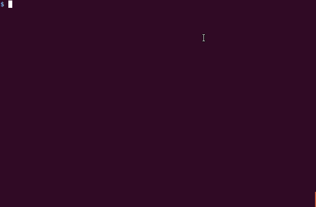
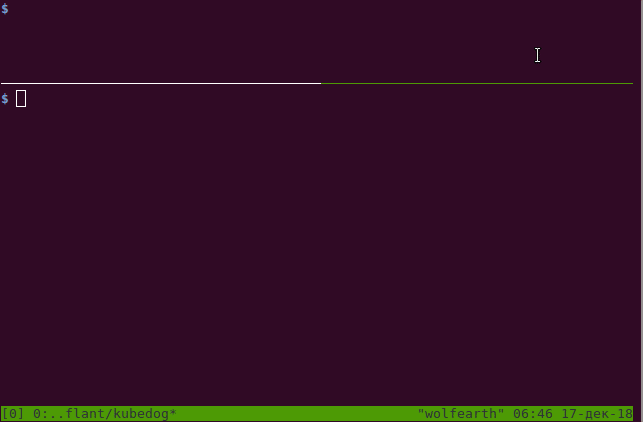

# kubedog

Kubedog is a library and cli utility that allows watching and following kubernetes resources in CI/CD deploy pipelines.

This library is used in the [dapp CI/CD tool](https://github.com/flant/dapp) to track resources during deploy process.

## Installation

### From source

Install library:

```
go get github.com/flant/kubedog
```

Compile `kubedog` cli util:

```
go install github.com/flant/kubedog/cmd/kubedog
```

### Cli util binary

[Linux amd64](https://dl.bintray.com/dapp/dapp/kubedog/linux-amd64/kubedog)

[Darwin amd64](https://dl.bintray.com/dapp/dapp/kubedog/darwin-amd64/kubedog)

## Cli

Kubedog cli utility is a tool that can be used to track what is going on with the specified resource.

There are 2 modes of resource tracking: follow and rollout. The commands are `kubedog follow ...` and `kubedog rollout track ...` respectively.

In the rollout and follow modes kubedog will print to the screen logs and other information related to the specified resource. Kubedog aimed to give enough information about resource for the end user, so that no additional kubectl invocation needed to debug and see what is going on with the resource. All data related to the resource will be unified into a single stream of events.

Follow mode can be used as simple `tail -f` tool, but for kubernetes resources.

Rollout mode can be used in CI/CD deploy pipeline to make sure that some resource is ready or done before proceeding deploy process. In this mode kubedog gives a reasonable error message and ensures to exit with non-zero error code if something wrong with the specified resource.





See `kubedog --help` for more info.

## Trackers

The tracker is the function that tracks events for the specified resource. There may be multiple types of trackers depending on the required actions in respond to resource related events. There are 2 tracker types currently available: [follow](#follow-tracker) and [rollout](#rollout-tracker).

Tracker aimed to give enough information about resource for the end user, so that no additional kubectl invocation needed to debug and see what is going on with the resource. All data related to the resource will be unified into a single stream of events.

Trackers are using kubernetes informers under the hood, which is a reliable primitive from kubernetes library, instead of using raw watch kubernetes api.

### Follow tracker

Follow tracker simply prints to the screen all resource related events. Follow tracker can be used as simple `tail -f` tool, but for kubernetes resources.

Import package:

```
import "github.com/flant/kubedog/pkg/trackers/follow"
```

Available functions:

```
TrackPod(name, namespace string, kube kubernetes.Interface, opts tracker.Options) error
TrackJob(name, namespace string, kube kubernetes.Interface, opts tracker.Options) error
TrackDeployment(name, namespace string, kube kubernetes.Interface, opts tracker.Options) error
TrackDaemonSet(name, namespace string, kube kubernetes.Interface, opts tracker.Options) error
TrackStatefulSet(name, namespace string, kube kubernetes.Interface, opts tracker.Options) error
```

Each function will block till specified resource is terminated. Returns error only in exceptional situation or on timeout.

Pod's related errors such as `CrashLoopBackOff`, `ErrImagePull` and other will be printed to the screen and error code will no be returned in this case.

`TrackDeployment` function will wait infinitely, until Deployment exists.

### Rollout tracker

Rollout tracker aimed to be used in the tools for the CI/CD deploy pipeline to make sure that some resource is ready or done before proceeding deploy process.

This tracker checks that resource is ready or done (in the case of the Job) before terminating. Resource logs and errors also printed to the screen.

Important differences from the [follow tracker](#follow-tracker) are:

* Function may return error code when resource is not ready or some userspace error occured in the resource (such as `CrashLoopBackOff` error in pod).
* If function returned `nil`, then it is safe to assume, that resource is ready or done (in the case of a Job).

Import package:

```
import "github.com/flant/kubedog/pkg/trackers/rollout"
```

Available functions:

```
TrackPod(name, namespace string, kube kubernetes.Interface, opts tracker.Options) error
TrackJob(name, namespace string, kube kubernetes.Interface, opts tracker.Options) error
TrackDeployment(name, namespace string, kube kubernetes.Interface, opts tracker.Options) error
TrackDaemonSet(name, namespace string, kube kubernetes.Interface, opts tracker.Options) error
TrackStatefulSet(name, namespace string, kube kubernetes.Interface, opts tracker.Options) error
```

## Use trackers examples

Track `mydeployment` Deployment in namespace `mynamespace` using rollout tracker:

```
import (
  "fmt"

  "github.com/flant/kubedog/pkg/trackers/rollout"
  "github.com/flant/kubedog/pkg/tracker"
  "github.com/flant/kubedog/pkg/kube"
)

func main() {
  var err error

  err = kube.Init()
  if err != nil {
    fmt.Printf("ERROR: %s\n", err)
    os.Exit(1)
  }

  err = rollout.TrackDeployment("mydeployment", "mynamespace", kube.Kubernetes, tracker.Options{Timeout: 300 * time.Second})
  if err != nil {
    fmt.Printf("ERROR: %s\n", err)
    os.Exit(1)
  }
}
```

Track `myjob` Job in namespace `mynamespace` using follow tracker:

```
import (
  "fmt"

  "github.com/flant/kubedog/pkg/trackers/follow"
  "github.com/flant/kubedog/pkg/tracker"
  "github.com/flant/kubedog/pkg/kube"
)

func main() {
  var err error

  err = kube.Init()
  if err != nil {
    fmt.Printf("ERROR: %s\n", err)
    os.Exit(1)
  }

  err = follow.TrackJob("myjob", "mynamespace", kube.Kubernetes, tracker.Options{Timeout: 300 * time.Second})
  if err != nil {
    fmt.Printf("ERROR: %s\n", err)
    os.Exit(1)
  }
}
```

## Custom trackers

To define a custom tracker one should call one of Track* function from `tracker` pkg and define callbacks for the resource events.

`feed` interface is used to specify callbacks. This interface defines a set of callbacks related to the resource events.

For example Track function for Pod resource is defined like this:

```
TrackPod(name, namespace string, kube kubernetes.Interface, feed PodFeed, opts Options) error
```

`PodFeed` is a set of callbacks:

```
type PodFeed interface {
	Added() error
	Succeeded() error
	Failed() error
	EventMsg(msg string) error
	Ready() error
	ContainerLogChunk(*ContainerLogChunk) error
	ContainerError(ContainerError) error
}
```

Each callback may return some error to interrupt the whole tracking process with error. Also special value `tracker.StopTrack` can be returned to interrupt tracking process without error.

Import package:

```
import "github.com/flant/kubedog/pkg/tracker"
```
